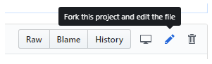
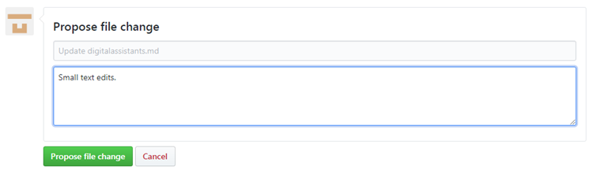
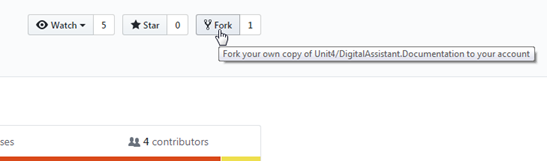

# Making contributions to Unit4 People Platform documentation

Thanks for being interested in contributing to the Unit4 People Platform documentation and this guide covers what you need to know. To make contributions you must have a GitHub account which is free and easy to create.

The Unit4 People Platform documentation is hosted on GitHub and is open source with public-facing repositories. This allows our users to contribute directly to our documentation and communicate with our developer teams via pull requests.

The documentation is written using Markdown which is an easy-to-read, easy-to-write syntax for formatting plain text. If you're new to Markdown then see [this guide](https://help.github.com/en/articles/basic-writing-and-formatting-syntax) for more details.

Each topic on the Unit4 People Platform documentation website includes an **Edit this topic** button to allow you to suggest changes. When you click this button, the corresponding source file is opened in GitHub for you to edit.

#### Making quick edits
To make quick edits where you want to do something such as fix a type or correct a sentence etc. you can just use the GitHub portal as follows:

1. Click the pencil icon to edit the topic as shown below. 

    > 

2. Make your changes in the web editor. Click the _**Preview changes**_ tab if you want to check the formatting of your change.

3. Once you're happy with your changes, scroll to the bottom of the page, enter a title and description for your changes and click **Propose file changes**.
    >

4. Create a pull request to ask the owners of the repository to "pull" your changes into their repository. If you're new to GitHub, see [About Pull Requests](https://help.github.com/en/articles/about-pull-requests) for more information.. When you clicked on **Propose file change** in the figure above, you should have been taken to a new page that looks like this:

    >

5. Click **Create pull request**, enter a title (and optionally a description) for the pull request, and then click **Create pull request** again. 

A Unit4 team member will review your pull request and merge it, or you might get some feedback with requests for other changes or proposals for alternative changes etc.

#### Making larger contributions

For larger contributions where you want to, for example, add one or more new topics then proceed as follows:

1. Create a fork of the repo into your own GitHub account.

     > 

2. Clone the forked repo to your local machine and make your changes in the local repo.
3. When you're ready for review, make a pull request to the upstream master branch.
    >

A Unit4 team member will review your pull request and merge it, or you might get some feedback with requests for other changes or proposals for alternative changes etc.

